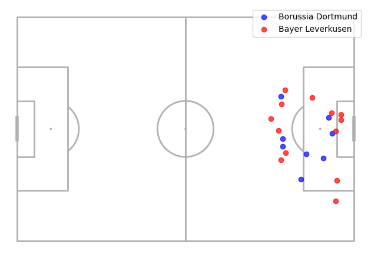

cat << 'EOF' > README.md
# 📊 Análise de Dados Esportivos: Mapeamento de Chutes com StatsBomb e mplsoccer

Este projeto foi desenvolvido com o objetivo de analisar eventos de partidas de futebol utilizando dados abertos da API pública da **StatsBomb**. O foco principal é a extração, tratamento e visualização espacial dos chutes de uma partida específica utilizando as bibliotecas `pandas` e `mplsoccer`.

A visualização final plota os eventos de finalização diretamente em um modelo digitalizado de campo de futebol, permitindo identificar padrões de ataque, volumes de finalização e comportamento ofensivo das equipes.

---

## 🎯 Resultado Visual

Abaixo está o mapa de chutes gerado pelo script, separando as equipes de forma espacial e quantitativa:

  

---

## 🛠️ Tecnologias e Ferramentas Utilizadas

- **Python**: Linguagem base para toda a pipeline.
- **Pandas**: Manipulação, filtragem e engenharia de recursos nas coordenadas estruturadas.
- **StatsBombpy**: Interface de comunicação com a API de dados abertos de futebol.
- **Mplsoccer & Matplotlib**: Renderização do campo de futebol (Pitch) e plotagem das coordenadas cartesianas dos chutes.

---

## 🧬 O que este projeto demonstra sobre minhas habilidades?

Para quem está avaliando este repositório para uma vaga de **Estágio em Desenvolvimento / Dados**, este código valida competências em:
1. **Consumo de APIs externas**: Autenticação implícita e requisição de dados estruturados em DataFrames.
2. **Tratamento de Dados Reais**: Limpeza de dados nulos, extração de listas aninhadas (transformação de coordenadas de `location` em colunas distintas `x` e `y`).
3. **Storytelling com Dados**: Capacidade de transformar linhas brutas de logs de eventos em um dashboard visual interpretável e de alto valor analítico.
4. **Organização de Código**: Estruturação lógica e limpa de um Jupyter Notebook, livre de mensagens poluídas de avisos internos (`warnings`).

---

