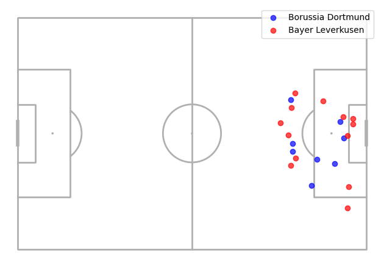

**🇺🇸 English:**
A practical Sports Analytics project focused on analyzing and visualizing football shots using open data from StatsBomb. Built with Python, Pandas and mplsoccer to extract shot events and create a spatial shot map for a Bundesliga match between Borussia Dortmund and Bayer Leverkusen.

**🇧🇷 Português:**
Um projeto prático de Sports Analytics focado na análise e visualização de chutes de futebol utilizando dados abertos da StatsBomb. Desenvolvido em Python, Pandas e mplsoccer para extrair eventos de finalização e criar um mapa espacial de chutes de uma partida da Bundesliga entre Borussia Dortmund e Bayer Leverkusen.

## ⚽ Match Analyzed

* **Competition:** Bundesliga 2023/24
* **Match:** Borussia Dortmund vs Bayer Leverkusen

## 📊 Shot Map

  

## 🛠️ Technologies

* Python
* Pandas
* StatsBombpy
* Matplotlib
* mplsoccer
* Jupyter Notebook
